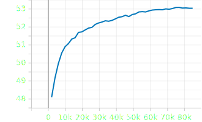

# Final solution

## Introduction

For the final solution I chose fine-tuning of one of the popular large language models - T5, specifically its small version.

T5 is known for its translation from one language to another. I thought that paraphrasing is between translation and summarization which T5 is also capable of. Hence, I wanted to try to adapt our problem as a translation task. For that I formulated the prefix for the model: ```paraphrase from toxic to neutral```

## Model

### T5 model structure


### To use the model with the trained weights you should unzip [this archive](https://github.com/system205/PMLDL_Assignment1/releases/download/final-solution/trained_model.zip) into ```/models``` folder

### And then use them as following:

```py
    text = "paraphrase from toxic to neutral: "  + '<your_text>'
    checkpoint = 'models/trained_model'
    
    tokenizer = AutoTokenizer.from_pretrained(checkpoint)
    model = AutoModelForSeq2SeqLM.from_pretrained(checkpoint)

    inputs = tokenizer(t, return_tensors="pt").input_ids
    outputs = model.generate(inputs, max_new_tokens=40, do_sample=True, 
    top_k=30, top_p=0.95, )
    
    # Output text
    translation = tokenizer.decode(outputs[0], skip_special_tokens=True)
```

## Training Process

1. I used ```AutoModelForSeq2SeqLM```, ```AutoTokenizer``` and ```DataCollatorForSeq2Seq``` for tokenization and model construction. I started from checkpoint 't5-small'

1. I used ```Seq2SeqTrainer``` api with the following arguments:

    ```py
    Seq2SeqTrainingArguments(
            output_dir=save_dir,
            evaluation_strategy="epoch",
            learning_rate=2e-5,
            per_device_train_batch_size=16,
            per_device_eval_batch_size=16,
            weight_decay=0.01,
            save_total_limit=3,
            num_train_epochs=45,
            predict_with_generate=True,
            disable_tqdm=True,
            report_to='tensorboard',
        )
    ```

1. For trainer I used ```DataCollatorForSeq2Seq``` and sacreBLEU metric. The trainer itself:

    ```py
    Seq2SeqTrainer(
        model=model,
        args=training_args,
        train_dataset=train_dataset,
        eval_dataset=val_dataset,
        tokenizer=tokenizer,
        data_collator=data_collator,
        compute_metrics=compute_metrics,
    )
    ```

## Results

### After 45 epoches I got the best BLEU score as 53%. Here is the graph of sacreBLEU score on validation dataset.



### Here is the examples of inputs and outputs to the model

```text
Translation: they invade france and they murder white people | Input: fucking niggers invade france and murder white gays
Translation: oh my big and beautiful pet | Input: suck my big and beautiful dick
Translation: it didn t mess with him | Input: it didn t fuck him
```

As you can see. The model does not return swearing words and paraphrase some of them.

#### As a **future work** I propose to appropriately postprocess the output to make it more readable:

- Capitalize some words
- Add punctuation
- Compact the words grammatically: don t -> don't
